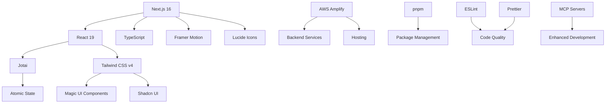
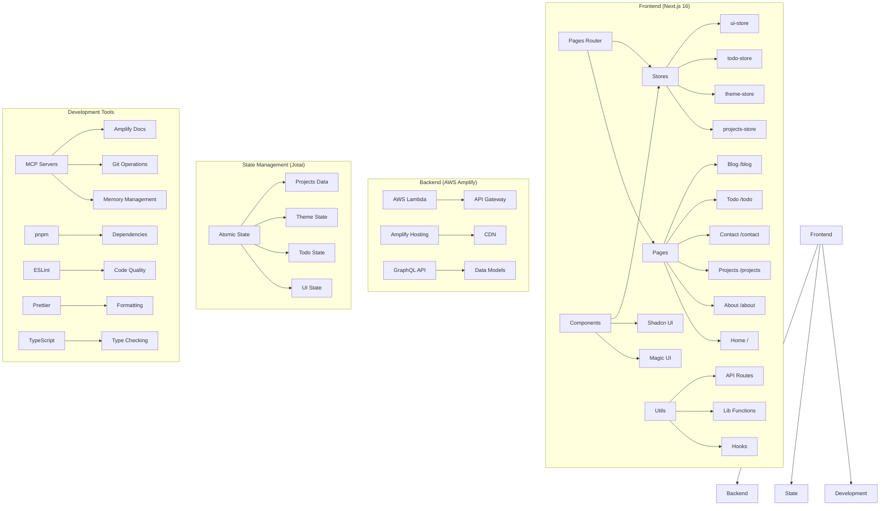
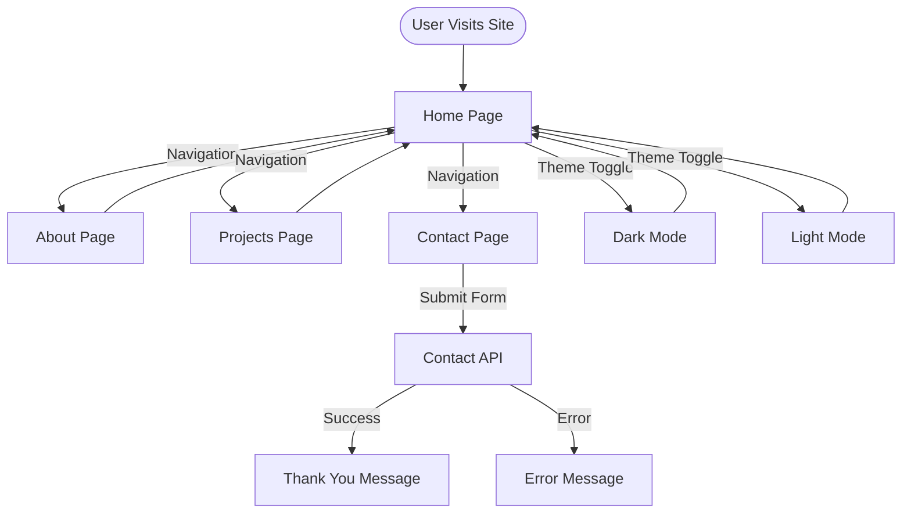
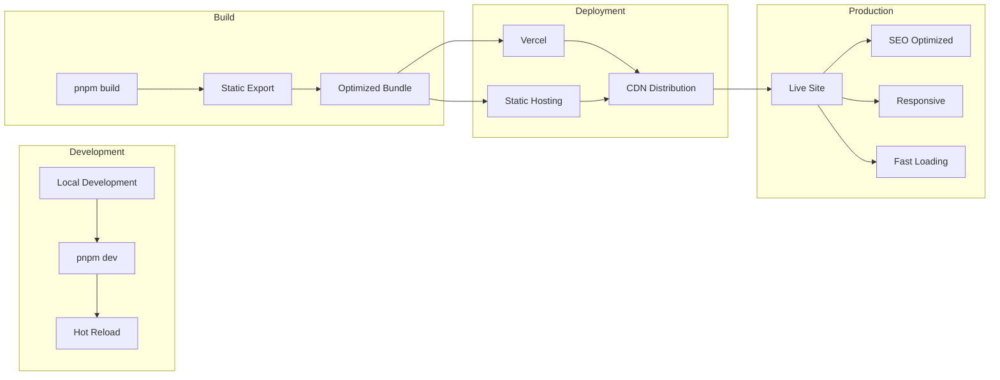

# Themistoklis Baltzakis - Portfolio

[](https://github.com/<OWNER>/<REPO>/actions/workflows/playwright.yml)
[](https://codecov.io/gh/<OWNER>/<REPO>)

[](https://nextjs.org/)
[](https://www.typescriptlang.org/)
[](https://tailwindcss.com/)
[](https://jotai.org/)
[](https://aws.amazon.com/amplify/)
[](LICENSE)

A modern, responsive portfolio website built with **Next.js 16**, **Jotai state management**, and **AWS Amplify**, showcasing cloud-native web solutions and professional expertise.

## CI & Coverage

- Playwright tests are run in GitHub Actions (`.github/workflows/playwright.yml`). The workflow badge is shown above.
- The workflow also produces a coverage report by running `npm run coverage` and uploads `coverage/lcov.info` as a build artifact which you can download from the workflow run.
- The workflow also uploads coverage to Codecov using `codecov/codecov-action@v4`.

### Adding `CODECOV_TOKEN` (private repos)

If your repository is **private**, add a `CODECOV_TOKEN` secret so Codecov can receive uploaded coverage reports:

1. Go to your repository on GitHub → **Settings** → **Secrets** → **Actions**.
2. Click **New repository secret**.
3. Set **Name** to `CODECOV_TOKEN` and **Value** to the token provided by Codecov for private repositories.
4. Save the secret — the CI workflow will use `secrets.CODECOV_TOKEN` to upload coverage.

Public repositories do not require a token and can upload coverage without one.

> If you want, provide your GitHub repository path (format: `owner/repo`) and I will replace the README badge placeholders so the badges display immediately.

## 🚀 Features

- **Next.js 16** - Latest version with App Router and Turbopack
- **Jotai State Management** - Atomic state management for React
- **AWS Amplify** - Cloud-native backend and hosting
- **Magic UI Components** - Beautiful, animated UI components
- **TypeScript** - Full TypeScript support
- **Tailwind CSS** - Utility-first CSS framework
- **Responsive Design** - Mobile-first approach
- **Dark Mode** - Built-in dark/light theme support
- **Modern Animations** - Smooth animations and transitions
- **SEO Optimized** - Built-in SEO features
- **MCP Servers** - Model Context Protocol integration

## 🛠️ Tech Stack

- **Frontend**: Next.js 16, React 19, TypeScript
- **State Management**: Jotai (Atomic state management)
- **Backend**: AWS Amplify, AWS Lambda, API Gateway
- **Styling**: Tailwind CSS v4, Magic UI Components
- **Animations**: Framer Motion, Motion
- **Icons**: Lucide React, Tabler Icons
- **Package Manager**: pnpm
- **Development**: Hot Module Replacement, ESLint, Prettier
- **MCP Integration**: Model Context Protocol servers

## 📋 Prerequisites

- Node.js 18.0+ (tested with 22.14.0+)
- pnpm 8+
- Git
- Python 3.8+ (for MCP servers)
- AWS Account (for Amplify deployment)

## 🔧 MCP Servers

This project includes several Model Context Protocol (MCP) servers for enhanced development capabilities:

- **Amplify Docs MCP**: AWS Amplify documentation and guidance
- **Git MCP**: Git operations and repository management
- **Memory MCP**: Context and memory management
- **Sequential Thinking MCP**: Enhanced reasoning capabilities

### Setting up MCP Servers

```bash
# Install Python dependencies for MCP servers
pip install -r requirements-mcp.txt

# Configure MCP servers (see MCP_SERVERS_README.md)
./configure-mcp.sh
```

## 🚀 Quick Start

### 1. Install Dependencies

```bash
pnpm install
```

### 2. Start Development Server

```bash
pnpm dev
```

The portfolio will be available at `http://localhost:3003`

### 3. Build for Production

```bash
pnpm build
pnpm start
```

## 📁 Project Structure

```
your-portfolio-autonomous/
├── amplify/                    # AWS Amplify backend configuration
│   ├── auth/                  # Authentication configuration
│   ├── data/                  # GraphQL schema and resolvers
│   └── backend.ts             # Amplify backend definition
├── components/                # React components
│   ├── ui/                    # Shadcn UI components
│   ├── contact/               # Contact-related components
│   ├── projects/              # Project-related components
│   ├── snapshot/              # Snapshot components
│   └── theme-toggle.tsx       # Theme switching component
├── config/                    # Configuration files
│   └── site.ts               # Site configuration
├── data/                      # Static data files
│   └── blogPosts.ts          # Blog post data
├── hooks/                     # Custom React hooks
│   ├── useToast.ts           # Toast notification hook
│   └── use-config.ts         # Configuration hook
├── lib/                       # Utility functions and data
│   ├── baltzakis-projects.ts # Project data utilities
│   ├── personal-data.ts      # Personal information
│   ├── utils.ts              # Utility functions
│   └── security/             # Security utilities
├── mcp_venv/                 # Python virtual environment for MCP
├── pages/                     # Next.js pages (Pages Router)
│   ├── api/                  # API routes
│   ├── blog/                 # Blog pages
│   ├── contact/              # Contact page
│   ├── cv/                   # CV/Resume page
│   ├── demo/                 # Demo pages
│   ├── projects/             # Projects pages
│   ├── todo/                 # Todo application
│   └── index.tsx             # Home page
├── stores/                    # Jotai state management
│   ├── index.ts              # Central store exports
│   ├── projects-store.ts     # Projects state management
│   ├── theme-store.ts        # Theme state management
│   ├── todo-store.ts         # Todo state management
│   └── ui-store.ts           # UI state management
├── styles/                    # Global styles
├── test-results/              # Test output directory
├── tests/                     # Test files
├── types/                     # TypeScript type definitions
└── public/                   # Static assets
```

## 🏗️ State Management Architecture

This portfolio uses **Jotai** for atomic state management, providing a modern and efficient approach to state management in React:

### Store Structure

- **projects-store.ts**: Manages project data, filtering, categories, and async operations
- **theme-store.ts**: Handles theme state with persistence and system preference detection
- **todo-store.ts**: Todo application state with CRUD operations
- **ui-store.ts**: Global UI state for toasts, modals, and loading states

### Key Features

- **Atomic Updates**: Fine-grained state updates for optimal performance
- **Type Safety**: Full TypeScript support with proper type definitions
- **Centralized Logic**: Business logic separated from UI components
- **Async Operations**: Built-in support for API calls and async state updates
- **Persistence**: Theme preferences and other state can be persisted

### Usage Pattern

```typescript
// Using atoms in components
import { useAtom } from '@/stores';
import { projectsAtom, loadingAtom } from '@/stores';

function ProjectsPage() {
  const [projects] = useAtom(projectsAtom);
  const [loading] = useAtom(loadingAtom);

  // Component logic here
}
```

## 🎨 Personal Information

The portfolio uses a centralized data structure in `lib/personal-data.ts` containing:

- **Personal Details**: Name, title, bio, location
- **Professional Experience**: Work history and achievements
- **Skills & Technologies**: Technical expertise organized by category
- **Projects**: Portfolio projects with descriptions and technologies
- **Services**: Offered services and capabilities
- **Contact Information**: Email, social links, availability

## 🔧 Available Scripts

- `pnpm dev` - Start development server with Turbopack
- `pnpm build` - Build for production
- `pnpm start` - Start production server
- `pnpm typecheck` - Run TypeScript type checking
- `pnpm lint` - Run ESLint
- `pnpm lint:fix` - Fix ESLint issues
- `pnpm format:fix` - Format code with Prettier
- `pnpm format:check` - Check code formatting
- `pnpm check` - Run all checks (lint, typecheck, format)
- `pnpm test` - Run test suite
- `pnpm test:watch` - Run tests in watch mode
- `pnpm amplify:dev` - Start Amplify development environment

## 🌐 Deployment

### AWS Amplify Deployment (Recommended)

This portfolio is configured for deployment on AWS Amplify with full-stack capabilities:

#### 🚀 Quick Deploy

1. **Connect to AWS Amplify:**

   ```bash
   # Install Amplify CLI
   npm install -g @aws-amplify/cli

   # Configure Amplify (if not already done)
   amplify configure

   # Initialize Amplify in your project
   amplify init

   # Add hosting
   amplify add hosting
   amplify add api      # For contact form backend
   amplify add auth     # For authentication (optional)
   ```

2. **Deploy to Amplify:**

   ```bash
   # Deploy all services
   amplify publish

   # Or deploy frontend only
   amplify hosting deploy
   ```

#### 🔧 Environment Variables

Configure these in your Amplify Console:

```bash
# Frontend Environment Variables
NEXT_PUBLIC_SITE_URL=https://your-domain.amplifyapp.com
NEXT_PUBLIC_API_URL=https://your-api-id.execute-api.region.amazonaws.com

# Backend Environment Variables (in Amplify Console)
CONTACT_EMAIL=your-email@example.com
SMTP_HOST=your-smtp-host
SMTP_USER=your-smtp-user
SMTP_PASS=your-smtp-password
```

#### 📊 Build Settings

The project includes `amplify.yml` with optimized build settings for:

- Next.js 16 with Turbopack
- Node.js 18 runtime
- Automatic dependency caching
- Build optimization for production

### Alternative Deployment Options

#### Vercel Deployment

```bash
# Install Vercel CLI
npm i -g vercel

# Deploy
vercel --prod
```

#### Docker Deployment

```bash
# Build Docker image
docker build -t portfolio-app .

# Run container
docker run -p 3000:3000 portfolio-app
```

## 📱 Responsive Design

The portfolio is built with a mobile-first approach using Tailwind CSS responsive utilities:

- **Mobile**: Default styles (no prefix)
- **Tablet**: `sm:` prefix (640px+)
- **Desktop**: `md:` prefix (768px+)
- **Large Desktop**: `lg:` prefix (1024px+)

## 🎯 Customization

### Personal Information

Edit `lib/personal-data.ts` to update:

- Personal details and bio
- Professional experience
- Skills and technologies
- Projects and services
- Contact information

### Site Configuration

Edit `config/site.ts` to update:

- Site name and URL
- Meta description
- Social links

### Styling

The portfolio uses Tailwind CSS for styling. Custom styles can be added in:

- `app/globals.css` - Global styles
- Component-level styling with Tailwind classes

## 🔍 SEO Features

Next.js provides built-in SEO features:

- Automatic meta tag generation
- Open Graph tags
- Twitter Card support
- Sitemap generation
- Robots.txt support

## 📚 Key Components

- **Magic UI Components**: Animated grid patterns, typing animations, and more
- **Shadcn UI**: Modern, accessible UI components
- **Theme Toggle**: Dark/light mode switching
- **Responsive Navigation**: Mobile-friendly navigation
- **Contact Forms**: Interactive contact functionality

## 📊 Diagrams & Architecture

### Tech Stack Overview



### Application Architecture



### Site Structure Flow



### Deployment Architecture



## 🤝 Based On

This portfolio is built using components and inspiration from:

- [Magic UI](https://magicui.design) - Beautiful React components
- [Shadcn UI](https://ui.shadcn.com) - Re-usable components
- [baltzakisthemis.com](https://baltzakisthemis.com) - Personal website content

## � Donate

If you find this portfolio helpful or inspiring, consider supporting the development:

[](https://www.buymeacoffee.com/themisbaltzakis)

Your support helps maintain and improve this project!

## �📄 License

This project is private and proprietary. All rights reserved.

## 📞 Contact

- **Website**: [baltzakisthemis.com](https://baltzakisthemis.com)
- **Email**: tbaltzakis@cloudless.gr
- **LinkedIn**: [Themistoklis Baltzakis](https://www.linkedin.com/in/baltzakis-themis)
- **GitHub**: [themisbaltzakis](https://github.com/themisbaltzakis)

---

Built with ❤️ using Next.js 16, Jotai, AWS Amplify, and modern web technologies.

_Last updated: December 22, 2025_
